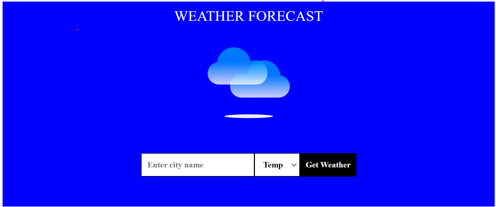
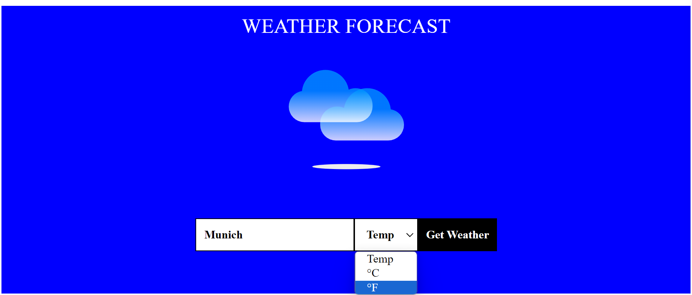
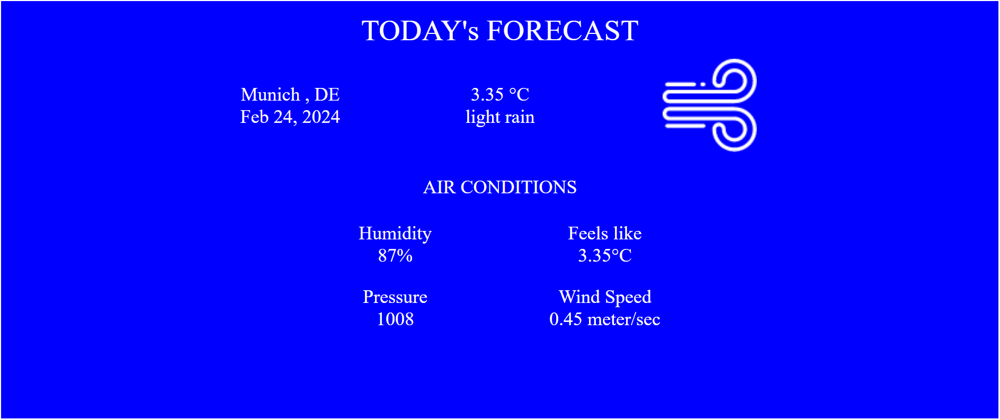

<br/>
<br/>

With [The Weather app] user can enter city name and select the temp units and can see the current day weather forecast details.
<br />
The app is developed using React.js and css.

<br/>


## ✨ Getting Started

- Make sure you already have `Node.js` and `npm` installed in your system.
- You need an API key from [OpenWeatherMap](https://openweathermap.org/). After creating an account, [grab your key](https://home.openweathermap.org/api_keys).
- Then, under the `src` directory, go to `utils/Utils` and replace `YOUR API KEY` with your OpenWeatherMap API Key.

<br/>

## ⚡ Install

- Clone the repository:

```bash
git clone https://github.com/swathidevdynamo/reactjs-css-weatherapp.git

```

- Install the packages using the command `npm install`

<br/>

## 📙 Used libraries

Check `packages.json` for details

<br/>

Thank You ☺
